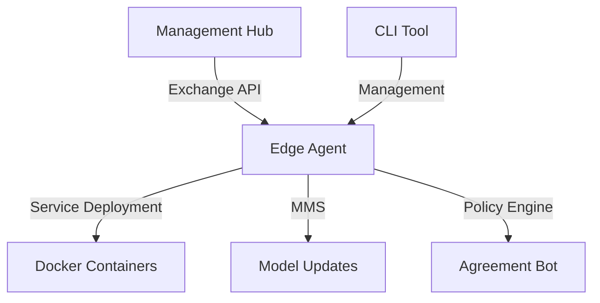

# AGENTS.md

## Overview

This document describes the agent architecture, types, and management capabilities provided by the hzn-cli toolkit for Open Horizon/IEAM edge computing deployments.

## Table of Contents

1. [Tech Stack](#tech-stack)
2. [Agent Architecture](#agent-architecture)
3. [Agent Types](#agent-types)
4. [Agent Lifecycle](#agent-lifecycle)
5. [Deployment Patterns](#deployment-patterns)
6. [Agent Operations](#agent-operations)
7. [Configuration](#configuration)
8. [Troubleshooting](#troubleshooting)

---

## Tech Stack

### Core Technologies

**Language & Runtime:**
- **TypeScript** (v4.5.5) - Main development language
- **Node.js** - Runtime environment (targeting ES2020)
- **ts-node** (v10.5.0) - TypeScript execution

**CLI Framework:**
- **Commander** (v8.2.0) - Command-line interface framework
- **Yargs** (v17.1.1) - Additional CLI argument parsing

### Key Dependencies

**User Interface:**
- **chalk** (v4.1.2) - Terminal string styling
- **figlet** (v1.5.2) - ASCII art text generation
- **clear** (v0.1.0) - Terminal clearing
- **prompt** & **prompt-sync** - Interactive user input

**Utilities:**
- **dotenv** (v10.0.0) - Environment variable management
- **jsonfile** (v6.1.0) - JSON file I/O
- **rxjs** (v7.3.0) - Reactive programming

### Development Tools

**Testing:**
- **Jest** (v27.5.1) - Testing framework
- **ts-jest** (v27.1.4) - TypeScript support for Jest
- **@types/jest** - TypeScript type definitions

**Development:**
- **nodemon** (v3.1.7) - Auto-restart during development
- **onchange** (v7.1.0) - File watcher for build automation
- **source-map-support** (v0.5.21) - Stack trace mapping

**Linting:**
- **@typescript-eslint/parser** (v5.12.0) - TypeScript ESLint parser

**Build System:**
- TypeScript compiler (tsc)
- Custom build scripts with file permissions and copying

### Project Type

This is a **CLI tool** (command-line interface) built as an **npm package** that:
- Manages Open Horizon/IEAM edge computing deployments
- Interacts with Docker, Kubernetes, and Open Horizon services
- Can be installed globally via npm (`npm i -g hzn-cli`)
- Provides the `oh` command for agent management

The project uses **CommonJS modules** and compiles TypeScript to JavaScript in the `./build` directory.

---

## Agent Architecture

### What is an Open Horizon Agent?

An Open Horizon agent (Anax) is a software component that runs on edge devices to:
- Communicate with the Open Horizon Management Hub
- Execute workload agreements
- Deploy and manage containerized services
- Handle Model Management Service (MMS) operations
- Enforce policies and patterns

### Core Components



**Key Components:**
- **Anax Agent**: Core agent software running on edge devices
- **Exchange**: Central registry for services, patterns, and policies
- **Agreement Bot (Agbot)**: Negotiates service deployment agreements
- **CSS/MMS**: Cloud Sync Service for model and data management
- **CLI (hzn)**: Command-line interface for agent management

---

## Agent Types

### 1. Standalone Agent
Native installation directly on the host operating system.

**Use Cases:**
- Production edge devices
- Bare metal deployments
- Maximum performance requirements

**Installation:**
```bash
oh deploy autoSetupCliOnly --config_file config.json
```

### 2. Containerized Agent (Anax-In-Container)
Agent runs in a Docker container with access to host Docker socket.

**Use Cases:**
- Development environments
- Multi-tenant edge nodes
- Isolated agent instances

**Installation:**
```bash
oh deploy autoSetupAnaxInContainer --config_file config.json
```

**Container Configuration:**
```bash
docker run -d -t --restart always \
  --name horizon1 \
  --privileged \
  -p 127.0.0.1:8081:8510 \
  -e DOCKER_NAME=horizon1 \
  -v /var/run/docker.sock:/var/run/docker.sock \
  openhorizon/amd64_anax:latest
```

### 3. CLI-In-Container
CLI tools run in container while agent runs on host or separate container.

**Use Cases:**
- Remote management
- CI/CD pipelines
- Automated deployments

**Installation:**
```bash
oh deploy autoSetupCliInContainer --config_file config.json
```

### 4. Mesh Agent (OH-Mesh)
Kubernetes-based agent deployment with service mesh capabilities.

**Use Cases:**
- Kubernetes edge clusters
- Multi-cluster deployments
- Advanced networking requirements

**Installation:**
```bash
oh deploy autoSetupOpenHorizonMesh --config_file config.json --k8s K3S
```

**Supported Kubernetes:**
- K3S (lightweight)
- K8S (full Kubernetes)

### 5. All-In-One
Complete stack including Management Hub, Agent, and CLI on single machine.

**Use Cases:**
- Development and testing
- Proof of concepts
- Training environments

**Installation:**
```bash
oh deploy autoSetupAllInOne --config_file config.json
```

---

## Agent Lifecycle

### 1. Installation

#### Prerequisites
- Docker installed and running
- Network connectivity to Management Hub
- Valid credentials (HZN_EXCHANGE_USER_AUTH)

#### Installation Methods

**Automated Setup:**
```bash
curl -sSL https://raw.githubusercontent.com/playground/hzn-cli/main/install.sh | bash
```

**Manual Installation:**
```bash
npm i -g hzn-cli
oh deploy setup
```

### 2. Configuration

**Required Configuration:**
```json
{
  "org": {
    "HZN_ORG_ID": "myorg",
    "HZN_EXCHANGE_USER_AUTH": "iamapikey:xxxxx",
    "HZN_EXCHANGE_URL": "http://hub.example.com:3090/v1",
    "HZN_FSS_CSSURL": "http://hub.example.com:9443/",
    "HZN_DEVICE_ID": "my-edge-device",
    "HZN_AGENT_PORT": "8510"
  },
  "service": {
    "SERVICE_NAME": "my-service",
    "SERVICE_VERSION": "1.0.0",
    "MMS_OBJECT_TYPE": "model_updates"
  }
}
```

**Setup Configuration:**
```bash
oh deploy setup
oh deploy showHznInfo
```

### 3. Registration

#### Pattern-Based Registration
Agents register with predefined service patterns.

```bash
# Register with pattern
oh deploy registerAgent

# With specific pattern
oh deploy publishMMSPattern --pattern pattern-my-service-arm64
```

#### Policy-Based Registration
Agents register with policies for dynamic service placement.

```bash
# Add node policy
oh deploy addPolicy

# Add deployment policy
oh deploy addDeploymentPolicy

# Register with policy
oh deploy addPolicy
```

**Node Policy Example:**
```json
{
  "properties": [
    {
      "name": "openhorizon.allowPrivileged",
      "value": true
    },
    {
      "name": "location",
      "value": "warehouse-1"
    }
  ],
  "constraints": [
    "device-type == camera"
  ]
}
```

### 4. Service Deployment

**Build and Publish Service:**
```bash
# Build service image
oh deploy buildServiceImage

# Push to registry
oh deploy pushServiceImage

# Publish service definition
oh deploy publishService

# Publish pattern
oh deploy publishPattern
```

**Complete Workflow:**
```bash
# Build, publish, and register in one command
oh deploy buildPublishAndRegister
```

### 5. Monitoring

**Check Agent Status:**
```bash
# View node information
oh deploy listNode

# List agreements
oh deploy listAgreement

# Check configuration state
oh deploy checkConfigState

# View running services
oh deploy listService
```

**Mesh Agent Monitoring:**
```bash
# List mesh pods
oh deploy meshPodList

# Check agent in pod
oh deploy meshNodeList --name agent-pod-name

# View agreements
oh deploy meshAgreementList --name agent-pod-name
```

### 6. Unregistration

**Unregister Agent:**
```bash
# Unregister and remove services
oh deploy unregisterAgent

# For mesh agents
oh deploy unregisterMeshAgent
oh deploy unregisterMeshAgentByName --name agent-pod-name
```

### 7. Cleanup

**Remove Agent:**
```bash
# Uninstall Horizon
oh deploy uninstallHorizon

# Remove containers
oh deploy removeAnaxContainer
oh deploy removeCliContainer

# Complete cleanup
oh deploy cleanUp
```

---

## Deployment Patterns

### Pattern 1: Run-In-Containers
Both CLI and Agent run in separate containers.

**Architecture:**
```
┌─────────────────────────────────┐
│         Host System             │
│  ┌──────────┐    ┌──────────┐  │
│  │ CLI      │    │  Anax    │  │
│  │Container │    │Container │  │
│  └──────────┘    └──────────┘  │
│         │              │        │
│         └──────┬───────┘        │
│                │                │
│         Docker Socket           │
└─────────────────────────────────┘
```

**Benefits:**
- Isolation between components
- Easy version management
- Portable across environments

**Setup:**
```bash
oh deploy autoSetupContainer --config_file config.json
```

### Pattern 2: All-In-One
Management Hub, Agent, and CLI on same machine.

**Architecture:**
```
┌─────────────────────────────────┐
│      Single Host System         │
│  ┌────────────────────────┐     │
│  │   Management Hub       │     │
│  │  - Exchange            │     │
│  │  - CSS/MMS             │     │
│  │  - Agbot               │     │
│  └────────────────────────┘     │
│  ┌────────────────────────┐     │
│  │   Edge Agent (Anax)    │     │
│  └────────────────────────┘     │
│  ┌────────────────────────┐     │
│  │   CLI Tools            │     │
│  └────────────────────────┘     │
└─────────────────────────────────┘
```

**Benefits:**
- Complete development environment
- No external dependencies
- Quick setup for testing

**Setup:**
```bash
oh deploy autoSetupAllInOne --config_file config.json
```

### Pattern 3: OH-Mesh (Kubernetes)
Agent deployed in Kubernetes with mesh networking.

**Architecture:**
```
┌─────────────────────────────────────┐
│      Kubernetes Cluster             │
│  ┌─────────────────────────────┐    │
│  │  Namespace: agent-ns        │    │
│  │  ┌──────────┐  ┌──────────┐│    │
│  │  │ Agent    │  │ Service  ││    │
│  │  │ Pod      │  │ Mesh     ││    │
│  │  └──────────┘  └──────────┘│    │
│  └─────────────────────────────┘    │
│  ┌─────────────────────────────┐    │
│  │  Deployments & Services     │    │
│  └─────────────────────────────┘    │
└─────────────────────────────────────┘
```

**Benefits:**
- Kubernetes-native deployment
- Service mesh integration
- Scalable edge clusters

**Setup:**
```bash
# With K3S
oh deploy autoSetupOpenHorizonMesh --config_file config.json --k8s K3S

# With K8S
oh deploy autoSetupOpenHorizonMesh --config_file config.json --k8s K8S
```

**Mesh Operations:**
```bash
# Create deployment
oh deploy createDeployment --name frontend --image myimage:latest

# Expose service
oh deploy exposeDeployment --name frontend --port 8080 --type LoadBalancer

# List resources
oh deploy meshPodList
oh deploy meshServiceList
```

---

## Agent Operations

### Service Management

**Publish Services:**
```bash
# Publish dependent service
oh deploy publishService

# Publish MMS service
oh deploy publishMMSService

# Publish with pattern
oh deploy publishServiceAndPattern
```

**List Services:**
```bash
# List all services
oh deploy listAllServices

# List specific service
oh deploy listService --name my-service

# Filter by architecture
oh deploy listService --filter arm64
```

**Remove Services:**
```bash
oh deploy removeService --name my-service --org myorg
```

### Pattern Management

**Publish Patterns:**
```bash
# Publish service pattern
oh deploy publishPattern

# Publish MMS pattern
oh deploy publishMMSPattern --config_path /path/to/config
```

**List Patterns:**
```bash
oh deploy listPattern --name pattern-name
oh deploy listNodePattern
```

### Policy Management

**Node Policies:**
```bash
# Add node policy
oh deploy addNodePolicy

# Add remote node policy
oh deploy addRemoteNodePolicy --name remote-node-id

# Edit node policy
oh deploy editNodePolicy

# List node policy
oh deploy listExchangeNodePolicy --name node-id
```

**Deployment Policies:**
```bash
# Add deployment policy
oh deploy addDeploymentPolicy

# List deployment policies
oh deploy listDeploymentPolicy --name policy-name

# Remove deployment policy
oh deploy removeDeploymentPolicy --name policy-name --org myorg

# Check deployment compatibility
oh deploy deployCheck --name policy-name
```

**Service Policies:**
```bash
# Add service policy
oh deploy addServicePolicy

# Edit service policy
oh deploy editServicePolicy

# List service policy
oh deploy listServicePolicy --name service-name --org myorg
```

### MMS (Model Management Service)

**Publish Objects:**
```bash
# Publish MMS object with pattern
oh deploy publishMMSObject \
  --object_type=model_updates \
  --object_id=config.json \
  --object=/path/to/model.zip \
  --pattern=pattern-mms-service-arm

# Publish with pattern metadata
oh deploy publishMMSObjectPattern --object=/path/to/model.zip

# Publish with policy
oh deploy publishMMSObjectPolicy --object=/path/to/model.zip
```

**List Objects:**
```bash
oh deploy listObject
```

**Remove Objects:**
```bash
oh deploy removeObject
oh deploy deleteObject
```

### Agreement Management

**List Agreements:**
```bash
# List local agreements
oh deploy listAgreement

# Watch agreements
oh deploy listAgreement --watch true

# Mesh agent agreements
oh deploy meshAgreementList --name agent-pod-name
```

### Node Management

**List Nodes:**
```bash
# List all nodes
oh deploy listNodes

# List specific node
oh deploy listNode --name node-id

# List exchange nodes
oh deploy listExchangeNode
```

**Remove Nodes:**
```bash
oh deploy removeNode --name node-id --org myorg
```

### Organization Management

**List Organizations:**
```bash
oh deploy listOrg
```

**Remove Organizations:**
```bash
oh deploy removeOrg --name org-name
```

---

## Configuration

### Environment Files

The toolkit uses three configuration files:

1. **`.env-hzn.json`** - Horizon-specific configuration
2. **`.env-local`** - Local environment variables
3. **`.env-support`** - Platform support configuration

### Configuration Structure

**Complete Configuration Example:**
```json
{
  "org": {
    "HZN_ORG_ID": "myorg",
    "HZN_DEVICE_TOKEN": "device-token",
    "HZN_DEVICE_ID": "my-edge-device",
    "HZN_EXCHANGE_USER_AUTH": "iamapikey:xxxxx",
    "HZN_EXCHANGE_URL": "http://hub.example.com:3090/v1",
    "HZN_FSS_CSSURL": "http://hub.example.com:9443/",
    "HZN_AGBOT_URL": "http://hub.example.com:3111",
    "HZN_SDO_SVC_URL": "http://hub.example.com:9008/api",
    "HZN_AGENT_PORT": "8510",
    "HZN_CSS": true,
    "CONFIG_CERT_PATH": "/path/to/cert.crt",
    "ANAX": "https://github.com/open-horizon/anax/releases/latest/download/agent-install.sh"
  },
  "service": {
    "SERVICE_NAME": "my-service",
    "SERVICE_CONTAINER_NAME": "my-service-container",
    "SERVICE_VERSION": "1.0.0",
    "SERVICE_VERSION_RANGE_UPPER": "1.0.0",
    "SERVICE_VERSION_RANGE_LOWER": "1.0.0",
    "SERVICE_CONTAINER_CREDS": "",
    "VOLUME_MOUNT": "/mms-shared",
    "MMS_SHARED_VOLUME": "mms_shared_volume",
    "MMS_OBJECT_TYPE": "model_updates",
    "MMS_OBJECT_ID": "config.json",
    "MMS_OBJECT_FILE": "config/config.json",
    "MMS_CONTAINER_CREDS": "",
    "MMS_CONTAINER_NAME": "mms-service",
    "MMS_SERVICE_NAME": "mms-service",
    "MMS_SERVICE_VERSION": "1.0.1",
    "MMS_SERVICE_FALLBACK_VERSION": "1.0.0",
    "UPDATE_FILE_NAME": "model.zip"
  },
  "folders": [
    "/var/tmp/horizon/horizon1/fss-domain-socket",
    "/var/tmp/horizon/horizon1/ess-auth",
    "/var/tmp/horizon/horizon1/secrets",
    "/var/tmp/horizon/horizon1/nmp"
  ],
  "local": {
    "YOUR_DOCKERHUB_ID": "dockerhub-username",
    "DOCKER_REGISTRY": "hub.docker.com",
    "DOCKER_TOKEN": "dckr_pat_xxxxx"
  },
  "register": {
    "policy": {
      "properties": [
        {
          "name": "openhorizon.allowPrivileged",
          "value": true
        }
      ],
      "deployment": {
        "properties": [
          {"name": "service-type", "value": "ML Model"}
        ]
      }
    }
  }
}
```

### Configuration Management

**Update Configuration:**
```bash
# Interactive update
oh deploy setup

# Update from file
oh deploy updateConfigFile --config_file config.json

# Show current configuration
oh deploy showHznInfo

# Update specific values
oh deploy updateHznInfo
```

**Skip Configuration Prompts:**
```bash
oh deploy <action> --skip_config_update true
```

---

## Troubleshooting

### Common Issues

#### 1. Agent Not Registering

**Symptoms:**
- Agent shows as unconfigured
- No agreements formed

**Solutions:**
```bash
# Check configuration
oh deploy checkConfigState
oh deploy isConfigured

# Verify connectivity
oh deploy showHznInfo

# Check node status
oh deploy listNode

# Review policies
oh deploy reviewPolicy
```

#### 2. Service Not Deploying

**Symptoms:**
- Agreement formed but service not running
- Container not starting

**Solutions:**
```bash
# Check agreements
oh deploy listAgreement

# Verify service definition
oh deploy reviewServiceDefinition

# Check deployment policy compatibility
oh deploy deployCheck --name policy-name

# View service logs
docker logs <container-name>
```

#### 3. MMS Objects Not Syncing

**Symptoms:**
- Objects published but not received by agent
- MMS service not running

**Solutions:**
```bash
# List objects
oh deploy listObject

# Check MMS service
oh deploy listService --filter mms

# Verify object policy
oh deploy listPolicy

# Re-publish object
oh deploy publishMMSObjectPolicy --object=/path/to/file
```

#### 4. Container Issues

**Symptoms:**
- Agent container not starting
- CLI container connection issues

**Solutions:**
```bash
# Check container status
docker ps -a

# View container logs
docker logs horizon1
docker logs hzn-cli

# Restart containers
oh deploy stopRemoveContainer
oh deploy autoSetupContainer --config_file config.json
```

#### 5. Mesh Agent Issues

**Symptoms:**
- Agent pod not running
- Kubernetes deployment failures

**Solutions:**
```bash
# Check pod status
oh deploy meshPodList

# View agent logs
oh deploy meshAgentEventLog --name agent-pod-name

# Check namespace
kubectl get all -n $AGENT_NAMESPACE

# Delete and recreate
oh deploy deleteAgentNamespace
oh deploy autoSetupOpenHorizonMesh --config_file config.json --k8s K3S
```

### Diagnostic Commands

```bash
# System information
oh deploy getDeviceArch

# Agent status
oh deploy listNode
oh deploy checkConfigState

# Service status
oh deploy listAllServices
oh deploy listAgreement --watch true

# Policy review
oh deploy reviewPolicy
oh deploy listPolicy

# Network connectivity
oh deploy showHznInfo
```

### Log Locations

**Standalone Agent:**
- Agent logs: `/var/log/horizon/`
- System logs: `journalctl -u horizon`

**Containerized Agent:**
- Container logs: `docker logs horizon1`
- Agent logs: `docker exec horizon1 cat /var/log/horizon/anax.log`

**Mesh Agent:**
- Pod logs: `kubectl logs -n $AGENT_NAMESPACE <pod-name>`
- Agent logs: `kubectl exec -n $AGENT_NAMESPACE <pod-name> -- cat /var/log/horizon/anax.log`

### Getting Help

```bash
# Command help
oh deploy -h
oh --help

# Test installation
oh deploy test
```

---

## Best Practices

### 1. Agent Deployment

- Use containerized agents for development
- Use standalone agents for production
- Implement proper certificate management
- Use unique device IDs per agent

### 2. Policy Design

- Start with patterns for simple deployments
- Use policies for dynamic placement
- Keep constraints specific but flexible
- Document policy requirements

### 3. Service Management

- Version services semantically
- Use service dependencies appropriately
- Implement health checks
- Monitor resource usage

### 4. Security

- Rotate credentials regularly
- Use private Docker registries
- Implement network policies
- Enable privileged mode only when necessary

### 5. Monitoring

- Watch agreements regularly
- Monitor MMS object sync
- Track service health
- Review agent logs

---

## Additional Resources

- [Open Horizon Documentation](https://open-horizon.github.io/)
- [IEAM Documentation](https://www.ibm.com/docs/en/eam)
- [GitHub Repository](https://github.com/playground/hzn-cli)
- [Docker Hub](https://hub.docker.com/u/openhorizon)

---

## Support

For issues and questions:
- GitHub Issues: https://github.com/playground/hzn-cli/issues
- Email: ljeff@us.ibm.com